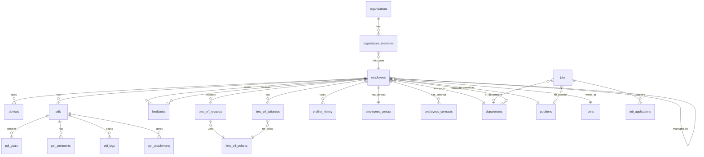
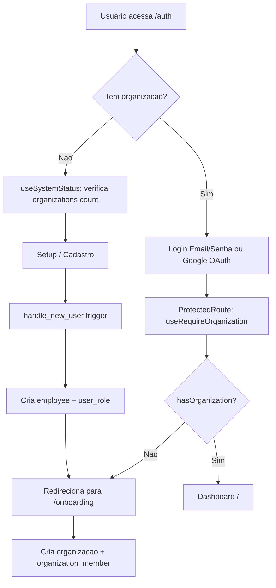

# Architecture Documentation

## 1. Visao Geral

### O que e o sistema

**Orb RH** e uma plataforma multi-tenant de gestao de recursos humanos que centraliza operacoes de People Analytics, Recrutamento (Vagas + Kanban de candidatos), PDIs, Feedbacks, Gestao de Ferias, Dispositivos, Desligamentos e Cultura Organizacional. O sistema oferece tambem analise de candidatos com IA (Anthropic Claude), profiler comportamental DISC e integracao com repositorios GitHub.

**[EVIDENCIA]** `index.html:6` (title "Orb RH"), `src/pages/Auth.tsx` (branding), `src/App.tsx:68-119` (rotas cobrindo todos os modulos)

### Premissas Fundamentais

| # | Premissa | Evidencia |
|---|----------|-----------|
| 1 | Desenvolvida e hospedada na plataforma **Lovable** (React 18 + Vite + TypeScript) | `package.json:59` (react ^18.3.1), `vite.config.ts:4` (lovable-tagger) |
| 2 | Backend **Lovable Cloud** (API compativel com Supabase): PostgreSQL + Auth + Storage + Edge Functions | `supabase/config.toml:1` (project_id: xoyahzteplhuwjfwprjz), `src/integrations/supabase/client.ts:2` |
| 3 | **RLS ativo** em todas as tabelas (27 tabelas) | `migration-dump/05-rls-policies.sql:11-36` (ALTER TABLE ... ENABLE ROW LEVEL SECURITY em 27 tabelas) |
| 4 | **Multi-tenant**: organizacoes isoladas com `organization_members` + `get_user_organization()` | `migration-dump/02-tables.sql:172-182` (organization_members), `migration-dump/03-functions.sql:66-78` (get_user_organization) |
| 5 | Autenticacao: Email/Senha + Google OAuth | `src/hooks/useAuth.ts:51-54` (signInWithPassword), `src/hooks/useAuth.ts:35` (lovable.auth.signInWithOAuth) |
| 6 | 11 Edge Functions (Deno) para operacoes sensiveis | `supabase/config.toml:3-34` (11 funcoes configuradas) |

### Filosofia de Design

- **Seguranca por Design** -- RLS em todas as tabelas; funcoes `SECURITY DEFINER` com `SET search_path = public`; rate limiting em todas Edge Functions
- **Backend como Fonte da Verdade** -- Triggers calculam PDI progress, goal completion, engagement; `handle_new_user()` cria employees/roles automaticamente
- **UI Moderna** -- shadcn/ui (Radix UI) + Tailwind CSS + tema customizavel por organizacao
- **Data Fetching Otimizado** -- TanStack Query para cache, invalidation e sincronizacao de estado server

---

## 2. Stack Tecnologica & Principais Bibliotecas

### Frontend

| Biblioteca | Versao | Uso |
|-----------|--------|-----|
| React | ^18.3.1 | Framework UI |
| TypeScript | ^5.8.3 | Type safety |
| Vite | ^5.4.19 | Build tool + dev server |
| React Router DOM | ^6.30.1 | Roteamento SPA |
| TanStack Query | ^5.83.0 | Data fetching, cache, mutations |
| React Hook Form | ^7.61.1 | Formularios |
| Zod | ^3.25.76 | Validacao de schemas |
| Tailwind CSS | ^3.4.17 | Utility-first CSS |
| shadcn/ui (Radix UI) | varios | Componentes UI acessiveis |
| Recharts | ^2.15.4 | Graficos e visualizacoes |
| Lucide React | ^0.462.0 | Icones |
| date-fns | ^3.6.0 | Manipulacao de datas |
| @dnd-kit | ^6.3.1 | Drag & drop (Kanban de candidatos) |
| xlsx | ^0.18.5 | Importacao/exportacao Excel |
| BlockNote | ^0.46.2 | Editor rich-text (block-based) |
| react-markdown | ^10.1.0 | Renderizacao Markdown |
| next-themes | ^0.3.0 | Dark/light mode |
| @lovable.dev/cloud-auth-js | ^0.0.2 | OAuth Google via Lovable |
| cmdk | ^1.1.1 | Command palette |

**[EVIDENCIA]** `package.json:13-74`

### Backend (Lovable Cloud)

| Componente | Uso |
|-----------|-----|
| PostgreSQL | BD principal com RLS, 27 tabelas, 3 views, 22 enums |
| Lovable Auth | Email/Senha + Google OAuth |
| Postgres Functions | 13 funcoes (has_role, get_user_organization, calculate_pdi_*, etc.) |
| Postgres Triggers | 27 triggers (updated_at, modified_by, PDI automations, new user) |
| Edge Functions (Deno) | 11 funcoes para integracoes, operacoes admin, IA |
| Storage Buckets | 4 buckets (resumes, employee-documents, pdi-attachments, company-logos) |

**[EVIDENCIA]** `supabase/config.toml`, `migration-dump/03-functions.sql`, `migration-dump/04-triggers.sql`, `migration-dump/06-storage.sql`

### Integracoes Externas

| Integracao | Uso | Secret Key | Evidencia |
|-----------|-----|------------|-----------|
| Anthropic Claude | Analise de candidatos + geracao de descritivos de cargo | `ANTHROPIC_API_KEY` (vault ou env) | `supabase/functions/analyze-candidate/index.ts:17`, `supabase/functions/generate-position-description/index.ts:247` |
| GitHub API | Repositorios, releases, tags | `GITHUB_TOKEN` | `supabase/functions/github-repos/index.ts` |
| Lovable Cloud Auth | Google OAuth | N/A (SDK nativo) | `src/integrations/lovable/index.ts:3` |

### Deployment

| Item | Valor | Evidencia |
|------|-------|-----------|
| Frontend | Lovable (hosting automatico) | `vite.config.ts:4` (lovable-tagger) |
| Backend | Lovable Cloud (project_id: `xoyahzteplhuwjfwprjz`) | `supabase/config.toml:1` |
| Producao | `https://orbrh.lovable.app` | Configuracao Lovable |

### Mapeamento de Secret Keys

| Secret | Escopo | Onde e Usado | Evidencia |
|--------|--------|-------------|-----------|
| `VITE_SUPABASE_URL` | Client (publico) | `supabase` client init | `src/integrations/supabase/client.ts:5` |
| `VITE_SUPABASE_PUBLISHABLE_KEY` | Client (publico) | `supabase` client init | `src/integrations/supabase/client.ts:6` |
| `VITE_USE_GRANULAR_PERMISSIONS` | Client (flag) | Feature flag para permissoes granulares | `src/config/featureFlags.ts:9` |
| `SUPABASE_URL` | Edge Functions | Acesso ao BD | Todas as Edge Functions |
| `SUPABASE_ANON_KEY` | Edge Functions | Cliente com JWT do usuario | `supabase/functions/change-user-role/index.ts:40` |
| `SUPABASE_SERVICE_ROLE_KEY` | Edge Functions | Bypass RLS (operacoes admin) | `supabase/functions/delete-employee/index.ts:29` |
| `ANTHROPIC_API_KEY` | Edge Functions | API Anthropic Claude | `supabase/functions/analyze-candidate/index.ts`, via vault ou env global |
| `GITHUB_TOKEN` | Edge Functions | API GitHub | `supabase/functions/github-repos/index.ts` |

---

## 3. Glossario & Modelo de Dominio

### Principais Entidades

| Entidade | Tabela | Descricao |
|----------|--------|-----------|
| Organization | `organizations` | Empresa/tenant; contem slug, logo, settings, plan_type |
| Organization Member | `organization_members` | Vinculo usuario-org com role e is_owner |
| Employee | `employees` | Colaborador (PK = auth.users.id); profiler DISC, termination data |
| Employee Contact | `employees_contact` | Dados de contato e endereco |
| Employee Contract | `employees_contracts` | Contrato CLT/PJ com salario e beneficios |
| Department | `departments` | Departamento com manager_id |
| Position | `positions` | Cargo base com flag has_levels |
| Unit | `units` | Filial/unidade com cidade/estado |
| Device | `devices` | Equipamento (computer, monitor, etc.) com status |
| Job | `jobs` | Vaga de emprego com status draft/active/closed/on_hold |
| Job Application | `job_applications` | Candidatura com dados demograficos, stage Kanban, AI report |
| Job Description | `job_descriptions` | Descritivo de cargo (position_type + seniority) |
| PDI | `pdis` | Plano de Desenvolvimento Individual com progress e engagement |
| PDI Goal | `pdi_goals` | Meta com checklist, weight, completion_ratio |
| PDI Comment | `pdi_comments` | Comentario com edit_history |
| PDI Log | `pdi_logs` | Log de eventos (comment_added, etc.) |
| PDI Attachment | `pdi_attachments` | Anexo vinculado a PDI/goal |
| Feedback | `feedbacks` | Feedback entre colaboradores (positive/neutral/negative) |
| Time Off Policy | `time_off_policies` | Politica de ferias |
| Time Off Balance | `time_off_balances` | Saldo anual (available_days = GENERATED ALWAYS) |
| Time Off Request | `time_off_requests` | Solicitacao com fluxo de aprovacao |
| User Role | `user_roles` | ⚠️ **DEPRECATED** - Use `organization_members.role_id` (ADR-0008) |
| Company Culture | `company_culture` | Missao, visao, valores, SWOT |
| Company Cost Settings | `company_cost_settings` | Taxas trabalhistas (INSS, FGTS, RAT) |
| Profiler History | `profiler_history` | Historico de testes DISC |
| Audit Log | `audit_log` | Log de auditoria com is_sensitive flag |

**[EVIDENCIA]** `migration-dump/02-tables.sql`, `src/integrations/supabase/types.ts`

### Views

| View | Descricao | Evidencia |
|------|-----------|-----------|
| `organizations_public` | Dados publicos da org (sem settings internos) | `src/integrations/supabase/types.ts:3027` |
| `jobs_public` | Vagas publicadas com dados da unidade | `src/integrations/supabase/types.ts:2981` |
| `employees_legal_docs_masked` | Documentos legais com mascaramento de CPF/RG/PIX | `src/integrations/supabase/types.ts:2939` |

### Diagrama ERD (Principais Relacionamentos)



**[EVIDENCIA]** `migration-dump/02-tables.sql` (FKs), `src/integrations/supabase/types.ts` (Relationships)

---

## 4. Mapa de Rotas do Front

### Rotas Protegidas (ProtectedRoute -- requer autenticacao + organizacao)

| Rota | Componente | Guard Adicional | Descricao |
|------|-----------|----------------|-----------|
| `/` | `Index` | -- | Dashboard principal |
| `/onboarding` | `Onboarding` | -- | Setup de organizacao (permite sem org) |
| `/employees` | `Employees` | -- | Lista de colaboradores |
| `/employees/:id` | `EmployeeProfile` | -- | Perfil do colaborador |
| `/employees/:id/pdi/:pdiId` | `PdiDetailPage` | -- | Detalhe do PDI |
| `/departments` | `Departments` | -- | Departamentos |
| `/departments/new` | `DepartmentFormPage` | -- | Criar departamento |
| `/departments/:id/edit` | `DepartmentFormPage` | -- | Editar departamento |
| `/positions` | `Positions` | -- | Cargos |
| `/positions/new` | `PositionFormPage` | -- | Criar cargo |
| `/positions/:id/edit` | `PositionFormPage` | -- | Editar cargo |
| `/profile` | `Profile` | -- | Perfil do usuario logado |
| `/import-csv` | `ImportCSV` | -- | Importacao CSV |
| `/culture` | `Culture` | -- | Cultura organizacional |
| `/terminations` | `Terminations` | -- | Desligamentos |
| `/time-off` | `TimeOff` | -- | Gestao de ferias |
| `/talent-bank` | `TalentBank` | -- | Banco de talentos |
| `/projects` | `Projects` | -- | Projetos GitHub |
| `/projects/:owner/:repo` | `ProjectChangelog` | -- | Changelog do projeto |
| `/vagas` | `Vagas` | -- | Gestao de vagas |
| `/vagas/:id` | `JobDetailPage` | -- | Detalhe da vaga |
| `/my-evaluations` | `MyEvaluations` | -- | Minhas avaliacoes |
| `/theme-editor` | `ThemeEditor` | -- | Editor de tema |

**[EVIDENCIA]** `src/App.tsx:68-107`

### Rotas Restritas (PeopleRoute -- admin ou people)

| Rota | Componente | Guard | Descricao |
|------|-----------|-------|-----------|
| `/people-analytics` | `PeopleAnalytics` | `PeopleRoute` | Analytics de RH |
| `/organogram` | `Organogram` | `PeopleRoute` | Organograma |
| `/import-employees` | `ImportEmployees` | `PeopleRoute` | Importacao de colaboradores |
| `/company-costs` | `CompanyCosts` | `PeopleRoute` | Custos da empresa |
| `/company-settings` | `CompanySettings` | `PeopleRoute` | Configuracoes |
| `/company-settings/integrations` | `IntegrationsSettings` | `PeopleRoute` | Integracoes |
| `/setup` | `Setup` | `PeopleRoute` | Setup inicial |
| `/skills-management` | `SkillsManagement` | `PeopleRoute` | Gestao de competencias |
| `/invites` | `PendingInvites` | `PeopleRoute` | Convites pendentes |
| `/feedbacks` | `Feedbacks` | `PeopleRoute` | Gestao de feedbacks |
| `/performance-evaluation` | `PerformanceEvaluation` | `PeopleRoute` | Avaliacao de desempenho |
| `/performance-evaluation/new` | `PerformanceEvaluation` | `PeopleRoute` | Nova avaliacao |
| `/performance-evaluation/:id/edit` | `PerformanceEvaluation` | `PeopleRoute` | Editar avaliacao |
| `/vagas/new` | `JobFormPage` | `PeopleRoute` | Criar vaga |
| `/vagas/:id/edit` | `JobFormPage` | `PeopleRoute` | Editar vaga |

**[EVIDENCIA]** `src/App.tsx:69-106`

### Rotas Restritas (AdminRoute -- somente admin)

| Rota | Componente | Guard | Descricao |
|------|-----------|-------|-----------|
| `/access-management` | `AccessManagement` | `AdminRoute` | Gestao de acessos |

**[EVIDENCIA]** `src/App.tsx:91`

### Rotas Publicas (Sem Autenticacao)

| Rota | Componente | Descricao |
|------|-----------|-----------|
| `/auth` | `Auth` | Login / Cadastro |
| `/vagas/:id/aplicar` | `JobApplicationPage` | Formulario de candidatura (publico) |
| `/vagas/00000000-...-000001/aplicar` | `TalentBankApplication` | Banco de talentos (UUID fixo) |
| `/carreiras/:slug` | `CareersPage` | Pagina de carreiras (multi-tenant via slug) |
| `/profiler-intro` | `ProfilerIntro` | Profiler comportamental - intro |
| `/profiler-etapa-1` | `ProfilerEtapa1` | Profiler - etapa 1 |
| `/profiler-etapa-2` | `ProfilerEtapa2` | Profiler - etapa 2 |
| `/profiler-resultado` | `ProfilerResultado` | Profiler - resultado |
| `*` | `NotFound` | 404 |

**[EVIDENCIA]** `src/App.tsx:109-119`

### Guards de Rota

| Guard | Arquivo | Logica |
|-------|---------|--------|
| `ProtectedRoute` | `src/components/ProtectedRoute.tsx:10-56` | Verifica `user` + `hasOrganization` via `useRequireOrganization()`; redireciona para `/auth` ou `/onboarding` |
| `PeopleRoute` | `src/components/PeopleRoute.tsx:12-52` | Verifica `isAdmin() \|\| isPeople()` via `useUserRole()`; redireciona para `/` se sem acesso |
| `AdminRoute` | `src/components/AdminRoute.tsx:12-50` | Verifica `isAdmin()` via `useUserRole()`; redireciona para `/` se sem acesso |

**[EVIDENCIA]** `src/components/ProtectedRoute.tsx:11` (useRequireOrganization), `src/components/PeopleRoute.tsx:17` (hasAccess), `src/components/AdminRoute.tsx:21` (isAdmin)

---

## 5. Autenticacao & Autorizacao

### Fluxo de Sessao



**[EVIDENCIA]** `src/hooks/useSystemStatus.ts:10-16`, `src/hooks/useRequireOrganization.ts:4-19`, `src/components/ProtectedRoute.tsx:26-29`

### Metodos de Autenticacao

| Metodo | Implementacao | Evidencia |
|--------|--------------|-----------|
| Email/Senha (login) | `supabase.auth.signInWithPassword()` | `src/hooks/useAuth.ts:51-54` |
| Email/Senha (signup) | `supabase.auth.signUp()` com emailRedirectTo | `src/hooks/useAuth.ts:59-68` |
| Google OAuth | `lovable.auth.signInWithOAuth("google")` via `@lovable.dev/cloud-auth-js` | `src/hooks/useAuth.ts:35`, `src/integrations/lovable/index.ts:9-10` |
| Logout | `supabase.auth.signOut()` | `src/hooks/useAuth.ts:71-73` |

### Criacao Automatica de Employee e Role (Trigger)

Quando um usuario se registra (`INSERT ON auth.users`), o trigger `handle_new_user()` executa:

1. **Devadmin bypass**: emails na lista `devadmin_emails` recebem role `admin` sem validacao de dominio
2. **Validacao de dominio**: emails fora de `@popcode.com.br` sao rejeitados (legado -- incompativel com multi-tenant)
3. **Cria `employees`** com id = auth user id, email, full_name do metadata
4. **Atribui role**: `admin` para emails especificos, `people` para RH, `user` para demais

**[EVIDENCIA]** `migration-dump/03-functions.sql:113-166`

### Persistencia de Sessao

- `localStorage` com `persistSession: true` e `autoRefreshToken: true`
- **[EVIDENCIA]** `src/integrations/supabase/client.ts:12-15`

### Roles e Permissoes

> **Atualizado 2026-02-08**: Sistema unificado em `organization_members + roles`. Tabela `user_roles` deprecada (ADR-0008).

| Role | Capacidades | Evidencia |
|------|-------------|-----------|
| `admin` | Acesso total: CRUD em todas entidades, exclusao permanente, gestao de acessos, custos, audit log | `src/hooks/useUserRole.ts:47`, policies RLS com `has_org_role(uid, org_id, 'admin')` |
| `people` | Gestao de RH: employees, PDIs, feedbacks, vagas, analytics, skills, avaliacoes | `src/hooks/useUserRole.ts:48`, `src/components/PeopleRoute.tsx:17` |
| `user` | Acesso basico: proprio perfil, PDIs onde e participante/manager, feedbacks enviados/recebidos, ferias proprias | Policies RLS com `auth.uid() = id` |

**[EVIDENCIA]** `migration-dump/01-enums.sql:9` (`CREATE TYPE app_role AS ENUM ('admin', 'people', 'user')`)

### Single Source of Truth (2026-02-08)

```
Frontend (useUserRole)  →  organization_members.role_id → roles.slug
RLS Policies            →  has_org_role(user_id, org_id, 'admin')
Edge Functions          →  checkOrgRole() helper
```

A tabela `user_roles` foi deprecada e sera removida na proxima major version.

### Sistema de Permissoes Granulares (Feature Flag)

Existe um sistema de permissoes granulares **em desenvolvimento** controlado por feature flag:

- Flag: `VITE_USE_GRANULAR_PERMISSIONS` -- **[EVIDENCIA]** `src/config/featureFlags.ts:9`
- Quando ativo: usa `get_org_user_permissions()` RPC para buscar permissoes especificas (e.g., `devices.view`, `employees.edit`)
- Quando inativo (padrao): fallback para `isAdmin() || isPeople()` do sistema de roles
- 33 permissoes definidas em `PERMISSIONS` constant

**[EVIDENCIA]** `src/hooks/usePermissions.ts:26-46` (query), `src/hooks/usePermissions.ts:127-183` (PERMISSIONS constant)

### Onde a Autorizacao Ocorre

| Camada | Mecanismo | Funcao |
|--------|-----------|--------|
| **Frontend (UX)** | `useUserRole()` + guards de rota | Esconde/mostra UI; NAO e seguranca real |
| **Frontend (UX)** | `usePermissions()` | Permissoes granulares (quando flag ativo) |
| **RLS (Seguranca Real)** | Policies em todas tabelas | `has_role()`, `auth.uid()`, ownership checks |
| **Edge Functions** | Validacao manual de JWT + role check | `user_roles` consultado com service_role_key |
| **Triggers** | `handle_new_user()` | Atribuicao de roles no cadastro |

---

## 6. Seguranca

### Matriz RLS Resumida

| Tabela | SELECT | INSERT | UPDATE | DELETE |
|--------|--------|--------|--------|--------|
| `organizations` | Publico (true) | admin/people | admin/people | admin/people |
| `organization_members` | Proprio + mesma org | owner/admin da org | owner/admin da org | owner da org |
| `employees` | Proprio + manager + admin/people | admin/people | Proprio + admin/people | admin |
| `employees_contact` | Proprio + admin/people | Proprio + admin/people | Proprio + admin/people | admin/people |
| `employees_contracts` | admin/people | admin/people | admin/people | admin |
| `user_roles` | Proprio (read-only) | -- (trigger only) | -- | -- |
| `devices` | Todos autenticados | admin/people | Proprio + admin/people | admin |
| `jobs` | Publico (true) + anon (active) | admin/people | admin/people | admin |
| `job_applications` | admin/people | Publico (true) | admin/people | admin |
| `job_descriptions` | Publico (true) | admin/people | admin/people | admin/people |
| `pdis` | Proprio + manager + admin/people | admin/people + manager | Nao-finalizado + admin/people + manager + proprio(rascunho) | admin (sem goals concluidas) |
| `pdi_goals` | Via PDI parent | Via PDI parent (nao-finalizado) | Via PDI parent | Via PDI parent |
| `pdi_comments` | Via PDI parent | Proprio (user_id = uid) + via PDI | Proprio | Proprio + admin |
| `pdi_logs` | Via PDI parent | Via PDI parent | -- | -- |
| `pdi_attachments` | Via PDI parent | Via PDI (nao-finalizado) | -- | Uploader + admin |
| `time_off_policies` | Ativas (todos) + admin (todas) | admin/people | admin/people | admin/people |
| `time_off_balances` | Proprio + admin/people | admin/people | admin/people | admin/people |
| `time_off_requests` | Proprio + admin/people | Proprio + admin/people | Proprio(pending) + admin/people | admin |
| `feedbacks` | Sender/receiver + admin/people | Proprio (sender) | -- | admin |
| `profiler_history` | Proprio + admin/people | Proprio + admin/people | -- | -- |
| `company_culture` | Publico (true) | admin/people | admin/people | admin/people |
| `company_cost_settings` | admin | admin | admin | admin |
| `audit_log` | admin | -- | -- | -- |
| `units` | Publico (true) | admin/people | admin/people | admin/people |
| `positions` | Publico (true) | admin/people | admin/people | admin/people |
| `departments` | Publico (true) | admin/people | admin/people | admin/people |

**[EVIDENCIA]** `migration-dump/05-rls-policies.sql` (completo, 542 linhas)

### Protecao Especial: user_roles

- Tabela `user_roles` e **read-only** para usuarios (apenas SELECT do proprio registro)
- Nao ha policies de INSERT/UPDATE/DELETE -- roles sao gerenciados **exclusivamente** via trigger `handle_new_user()` ou operacoes com `SERVICE_ROLE_KEY`
- Isso previne **privilege escalation** direto pelo cliente

**[EVIDENCIA]** `migration-dump/05-rls-policies.sql:196-201`

### CORS

```
Access-Control-Allow-Origin: *
Access-Control-Allow-Methods: GET,POST,PUT,PATCH,DELETE,OPTIONS
Access-Control-Allow-Headers: authorization, x-client-info, apikey, content-type, x-supabase-client-platform, x-supabase-client-platform-version, x-supabase-client-runtime, x-supabase-client-runtime-version
```

**[EVIDENCIA]** `supabase/functions/_shared/cors.ts:1-8`

**Nota**: CORS wildcard e aceitavel porque seguranca e enforced via RLS + JWT. Cada request carrega o JWT do usuario e o RLS filtra os dados.

### Rate Limiting

Todas as Edge Functions implementam rate limiting via `checkRateLimit()`:

| Funcao | Limite | Janela |
|--------|--------|--------|
| `analyze-candidate` | 50 req | 60s |
| `generate-position-description` | 50 req | 60s |
| `submit-application` | 30 req | 60s |
| `invite-employee` | 10 req | 60s |
| `delete-employee` | 5 req | 60s |
| `terminate-employee` | 10 req | 60s |
| `change-user-role` | 10 req | 60s |
| `manage-secrets` | 20 req | 60s |
| `github-repos` | 30 req | 60s |
| `github-releases` | 30 req | 60s |
| `github-tags` | 30 req | 60s |

- Key: `user:{userId}` (autenticado) ou `ip:{address}` (anonimo)
- Implementacao: RPC `check_rate_limit` no PostgreSQL (atomico)
- **Fail-open**: se RPC falhar, request e permitido

**[EVIDENCIA]** `supabase/functions/_shared/rate-limit.ts:45-66` (RATE_LIMITS), `supabase/functions/_shared/rate-limit.ts:89-95` (fail-open)

### Segredos e Variaveis de Ambiente

| Variavel | Escopo | Seguro Expor? | Evidencia |
|----------|--------|---------------|-----------|
| `VITE_SUPABASE_URL` | Client | Sim (publico) | `src/integrations/supabase/client.ts:5` |
| `VITE_SUPABASE_PUBLISHABLE_KEY` | Client | Sim (anon key) | `src/integrations/supabase/client.ts:6` |
| `VITE_USE_GRANULAR_PERMISSIONS` | Client | Sim (flag) | `src/config/featureFlags.ts:9` |
| `SUPABASE_SERVICE_ROLE_KEY` | Edge Functions | **NAO** (bypass RLS) | `supabase/functions/delete-employee/index.ts:29` |
| `ANTHROPIC_API_KEY` | Edge Functions | **NAO** (custo) | Via vault ou env global |
| `GITHUB_TOKEN` | Edge Functions | **NAO** (acesso repos) | Edge Functions github-* |

### Criptografia de API Keys (Vault)

- API keys de integracoes sao armazenadas criptografadas com AES-256-GCM na tabela `organization_integrations`
- Modulo `_shared/crypto.ts` faz encrypt/decrypt
- Auto-upgrade de formato legado para PBKDF2
- Logs de acesso em `integration_access_logs`

**[EVIDENCIA]** `supabase/functions/_shared/get-integration-secret.ts:30-146`, `supabase/functions/_shared/crypto.ts`

### LGPD e Privacidade

- **Dados sensiveis**: CPF, RG, PIX mascarados via view `employees_legal_docs_masked`
- **Exclusao permanente** (LGPD): Edge Function `delete-employee` com cascade completo + audit log marcado `is_sensitive: true`
- **Diversidade**: dados demograficos (`gender`, `ethnicity`, `sexual_orientation`) coletados opcionalmente em candidaturas
- **Storage**: Curriculos em bucket privado; documentos isolados por pasta do usuario

**[EVIDENCIA]** `src/integrations/supabase/types.ts:2939` (view mascarada), `supabase/functions/delete-employee/index.ts:136-149` (audit LGPD)

---

## 7. Padroes de Acesso a Dados

### Consultas Diretas ao Supabase (com RLS) -- Padrao Dominante

A grande maioria das operacoes de dados sao consultas diretas do frontend ao PostgreSQL via `supabase-js`, protegidas por RLS:

```typescript
const { data, error } = await supabase
  .from("employees")
  .select(`*, departments(name), positions(title)`)
  .order("full_name");
```

**[EVIDENCIA]** Hooks em `src/hooks/useEmployees.ts`, `src/hooks/useDevices.ts`, etc.

### Edge Functions para Operacoes Sensiveis

Usadas quando:
- Requer `SERVICE_ROLE_KEY` (bypass RLS para operacoes admin)
- Integracao com APIs externas (Anthropic, GitHub)
- Cascade deletion complexo
- Operacoes de seguranca (ban user, delete auth user)

**[EVIDENCIA]** `supabase/functions/delete-employee/index.ts` (cascade + auth delete), `supabase/functions/analyze-candidate/index.ts` (Anthropic API)

### Gerenciamento de Estado (Client)

| Ferramenta | Uso | Evidencia |
|-----------|-----|-----------|
| TanStack Query | Cache de dados do servidor, invalidation, mutations | `package.json:50` |
| React Context | `OrganizationContext` (org ativa), `AppearanceContext` (tema) | `src/contexts/OrganizationContext.tsx`, `src/contexts/AppearanceContext.tsx` |
| localStorage | Sessao, org ativa (`popcode_current_org_id`) | `src/integrations/supabase/client.ts:13`, `src/contexts/OrganizationContext.tsx:6` |
| URL params | Navegacao (IDs em rotas) | `src/App.tsx` (`:id`, `:pdiId`, `:slug`) |

### Paginacao

**Status**: Nao implementada na maioria das queries. Hooks como `useEmployees`, `useDevices` buscam todos os registros.

**Risco**: Performance degrada com grandes volumes.

**[EVIDENCIA]** Ausencia de `.range()` nos hooks de dados

### Tratamento de Erros

| Camada | Padrao | Evidencia |
|--------|--------|-----------|
| Frontend | Try/catch + toast (Sonner/Toaster) via `onError` do TanStack Query | `src/hooks/useAuth.ts:42-47` |
| Edge Functions (recentes) | RFC 7807 Problem Details (`application/problem+json`) | `supabase/functions/change-user-role/index.ts:32-33` |
| Edge Functions (legadas) | JSON simples `{ error: "mensagem" }` | `supabase/functions/delete-employee/index.ts:35-36` |

---

## 8. Banco & Storage

### Tabelas (27 tabelas + 3 views)

| Tabela | organization_id? | RLS | Indices | Evidencia |
|--------|-----------------|-----|---------|-----------|
| `organizations` | -- (e a org) | Sim | PK | `migration-dump/02-tables.sql:11` |
| `organization_members` | Sim (FK) | Sim | UNIQUE(org, user) | `migration-dump/02-tables.sql:172` |
| `employees` | Nao (via org_members) | Sim | email, status, department, manager | `migration-dump/02-tables.sql:70` |
| `employees_contact` | Nao | Sim | PK(user_id) | `migration-dump/02-tables.sql:126` |
| `employees_contracts` | Nao | Sim | -- | `migration-dump/02-tables.sql:148` |
| `departments` | Nao | Sim | -- | `migration-dump/02-tables.sql:111` |
| `positions` | Nao | Sim | -- | `migration-dump/02-tables.sql:58` |
| `units` | Nao | Sim | -- | `migration-dump/02-tables.sql:44` |
| `devices` | Nao | Sim | user_id, status, type, serial | `migration-dump/02-tables.sql:197` |
| `jobs` | Nao | Sim | status | `migration-dump/02-tables.sql:220` |
| `job_applications` | Nao | Sim | job_id, stage | `migration-dump/02-tables.sql:236` |
| `job_descriptions` | Nao | Sim | -- | `migration-dump/02-tables.sql:268` |
| `pdis` | Nao | Sim | employee_id, status | `migration-dump/02-tables.sql:281` |
| `pdi_goals` | Nao | Sim | pdi_id | `migration-dump/02-tables.sql:304` |
| `pdi_comments` | Nao | Sim | -- | `migration-dump/02-tables.sql:326` |
| `pdi_logs` | Nao | Sim | -- | `migration-dump/02-tables.sql:339` |
| `pdi_attachments` | Nao | Sim | -- | `migration-dump/02-tables.sql:353` |
| `time_off_policies` | Nao | Sim | -- | `migration-dump/02-tables.sql:368` |
| `time_off_balances` | Nao | Sim | UNIQUE(employee, policy, year) | `migration-dump/02-tables.sql:384` |
| `time_off_requests` | Nao | Sim | employee_id, status | `migration-dump/02-tables.sql:400` |
| `feedbacks` | Nao | Sim | sender_id, receiver_id | `migration-dump/02-tables.sql:419` |
| `profiler_history` | Nao | Sim | -- | `migration-dump/02-tables.sql:432` |
| `company_culture` | Sim (types.ts) | Sim | -- | `migration-dump/02-tables.sql:444` |
| `company_cost_settings` | Sim (types.ts) | Sim | -- | `migration-dump/02-tables.sql:461` |
| `user_roles` | Nao | Sim | UNIQUE(user, role) | `migration-dump/02-tables.sql:187` |
| `audit_log` | Nao | Sim | user_id, (resource_type,resource_id), created_at | `migration-dump/02-tables.sql:476` |

### Enums (22 tipos)

| Enum | Valores | Evidencia |
|------|---------|-----------|
| `app_role` | admin, people, user | `migration-dump/01-enums.sql:9` |
| `contract_type` | clt, pj, internship, temporary, other | `migration-dump/01-enums.sql:12` |
| `employment_type` | full_time, part_time, contractor, intern | `migration-dump/01-enums.sql:13` |
| `employee_status` | active, on_leave, terminated | `migration-dump/01-enums.sql:16` |
| `device_type` | computer, monitor, mouse, keyboard, headset, webcam, phone, tablet, apple_tv, chromecast, cable, charger, other | `migration-dump/01-enums.sql:19-23` |
| `device_status` | borrowed, available, office, defective, returned, not_found, maintenance, pending_format, pending_return, sold, donated | `migration-dump/01-enums.sql:24-28` |
| `job_status` | active, closed, draft, on_hold | `migration-dump/01-enums.sql:31` |
| `candidate_stage` | selecao, fit_cultural, fit_tecnico, pre_admissao, banco_talentos, rejeitado, contratado | `migration-dump/01-enums.sql:32-35` |
| `time_off_status` | pending_people, approved, rejected, cancelled | `migration-dump/01-enums.sql:38` |
| `pdi_status` | rascunho, em_andamento, entregue, concluido, cancelado | `migration-dump/01-enums.sql:41` |
| `pdi_goal_status` | pendente, em_andamento, concluida | `migration-dump/01-enums.sql:42` |
| `pdi_goal_type` | tecnico, comportamental, lideranca, carreira | `migration-dump/01-enums.sql:43` |
| `gender` | male, female, non_binary, prefer_not_to_say | `migration-dump/01-enums.sql:46` |
| `ethnicity` | white, black, brown, asian, indigenous, not_declared | `migration-dump/01-enums.sql:47` |
| `marital_status` | single, married, divorced, widowed, domestic_partnership, prefer_not_to_say | `migration-dump/01-enums.sql:48` |
| `education_level` | elementary...postdoc (8 niveis) | `migration-dump/01-enums.sql:49-52` |
| `position_level` | junior, mid, senior, lead, manager, director, executive | `migration-dump/01-enums.sql:55` |
| `position_level_detail` | junior_i...senior_iii (9 niveis) | `migration-dump/01-enums.sql:56-60` |
| `termination_reason` | pedido_demissao, sem_justa_causa, justa_causa, etc. (7) | `migration-dump/01-enums.sql:63-66` |
| `termination_decision` | pediu_pra_sair, foi_demitido | `migration-dump/01-enums.sql:67` |
| `termination_cause` | recebimento_proposta, baixo_desempenho, corte_custos, etc. (7) | `migration-dump/01-enums.sql:68-71` |
| `feedback_type` | positive, neutral, negative | `migration-dump/01-enums.sql:74` |

### Funcoes do Banco (13 funcoes)

| Funcao | Tipo | Descricao | Evidencia |
|--------|------|-----------|-----------|
| `has_role(uuid, app_role)` | SECURITY DEFINER | Verifica role do usuario em `user_roles` | `migration-dump/03-functions.sql:11-24` |
| `has_org_role(uuid, uuid, app_role)` | SECURITY DEFINER | Verifica role na organizacao (`organization_members`) | `migration-dump/03-functions.sql:29-43` |
| `user_belongs_to_org(uuid, uuid)` | SECURITY DEFINER | Verifica se usuario pertence a org | `migration-dump/03-functions.sql:48-61` |
| `get_user_organization(uuid)` | SECURITY DEFINER | Retorna org do usuario (ORDER BY is_owner, joined_at) | `migration-dump/03-functions.sql:66-78` |
| `update_updated_at_column()` | Trigger fn | Seta `NEW.updated_at = now()` | `migration-dump/03-functions.sql:83-93` |
| `set_modified_by()` | Trigger fn | Seta `NEW.modified_by = auth.uid()` | `migration-dump/03-functions.sql:98-108` |
| `handle_new_user()` | Trigger fn | Cria employee + role no signup | `migration-dump/03-functions.sql:113-166` |
| `calculate_goal_completion()` | Trigger fn | Calcula completion_ratio da goal via checklist | `migration-dump/03-functions.sql:171-211` |
| `calculate_pdi_progress()` | Trigger fn | Media ponderada de goals -> progress do PDI | `migration-dump/03-functions.sql:216-243` |
| `calculate_pdi_status()` | Trigger fn | Status automatico do PDI baseado em goals | `migration-dump/03-functions.sql:248-297` |
| `calculate_pdi_engagement()` | Trigger fn | Engagement score baseado em logs/dias | `migration-dump/03-functions.sql:302-342` |
| `check_one_active_pdi_per_employee()` | Trigger fn | Impede >1 PDI ativo por colaborador | `migration-dump/03-functions.sql:347-372` |
| `log_pdi_comment_created()` | Trigger fn | Registra log ao criar comentario | `migration-dump/03-functions.sql:377-393` |
| `insert_audit_log(...)` | Funcao | Insere registro no audit_log | `migration-dump/03-functions.sql:398-439` |

### Triggers (27 triggers)

| Trigger | Tabela | Evento | Funcao | Evidencia |
|---------|--------|--------|--------|-----------|
| `on_auth_user_created` | `auth.users` | AFTER INSERT | `handle_new_user()` | `migration-dump/04-triggers.sql:11-13` |
| `update_*_updated_at` (18x) | Varias | BEFORE UPDATE | `update_updated_at_column()` | `migration-dump/04-triggers.sql:20-117` |
| `set_*_modified_by` (3x) | contracts, culture, cost_settings | BEFORE UPDATE | `set_modified_by()` | `migration-dump/04-triggers.sql:123-133` |
| `calculate_goal_completion_trigger` | `pdi_goals` | BEFORE INSERT/UPDATE OF checklist_items | `calculate_goal_completion()` | `migration-dump/04-triggers.sql:140-142` |
| `calculate_pdi_progress_trigger` | `pdi_goals` | AFTER INSERT/UPDATE/DELETE | `calculate_pdi_progress()` | `migration-dump/04-triggers.sql:145-147` |
| `calculate_pdi_status_trigger` | `pdi_goals` | AFTER INSERT/UPDATE | `calculate_pdi_status()` | `migration-dump/04-triggers.sql:150-152` |
| `calculate_pdi_engagement_trigger` | `pdi_logs` | AFTER INSERT | `calculate_pdi_engagement()` | `migration-dump/04-triggers.sql:155-157` |
| `log_pdi_comment_created_trigger` | `pdi_comments` | AFTER INSERT | `log_pdi_comment_created()` | `migration-dump/04-triggers.sql:160-162` |
| `check_one_active_pdi_trigger` | `pdis` | BEFORE INSERT/UPDATE OF status | `check_one_active_pdi_per_employee()` | `migration-dump/04-triggers.sql:165-169` |

### Storage Buckets (4 buckets)

| Bucket | Publico | Limite | MIME Types | Evidencia |
|--------|---------|--------|------------|-----------|
| `resumes` | Nao | 10MB | PDF, DOC, DOCX | `migration-dump/06-storage.sql:13-20` |
| `company-logos` | Sim | 5MB | JPEG, PNG, WebP, SVG | `migration-dump/06-storage.sql:23-30` |
| `employee-documents` | Nao | -- | -- | `migration-dump/06-storage.sql:99-152` |
| `pdi-attachments` | Nao | -- | -- | `migration-dump/06-storage.sql:155-232` |

### Politicas de Storage

| Bucket | Operacao | Condicao | Evidencia |
|--------|----------|----------|-----------|
| `resumes` | INSERT | Publico (qualquer um) | `migration-dump/06-storage.sql:37-39` |
| `resumes` | SELECT | admin/people | `migration-dump/06-storage.sql:42-49` |
| `resumes` | DELETE | admin | `migration-dump/06-storage.sql:52-57` |
| `company-logos` | SELECT | Publico | `migration-dump/06-storage.sql:64-66` |
| `company-logos` | INSERT/UPDATE | admin/people | `migration-dump/06-storage.sql:69-86` |
| `company-logos` | DELETE | admin | `migration-dump/06-storage.sql:89-94` |
| `employee-documents` | SELECT | Proprio (pasta = uid) + admin/people | `migration-dump/06-storage.sql:101-116` |
| `employee-documents` | INSERT | Proprio (pasta = uid) + admin/people | `migration-dump/06-storage.sql:119-134` |
| `employee-documents` | UPDATE | admin/people | `migration-dump/06-storage.sql:137-143` |
| `employee-documents` | DELETE | admin | `migration-dump/06-storage.sql:146-152` |
| `pdi-attachments` | SELECT | Proprio + manager (via PDI) + admin/people | `migration-dump/06-storage.sql:159-187` |
| `pdi-attachments` | INSERT | Proprio + admin/people | `migration-dump/06-storage.sql:190-205` |
| `pdi-attachments` | UPDATE | Proprio + admin/people | `migration-dump/06-storage.sql:208-223` |
| `pdi-attachments` | DELETE | admin | `migration-dump/06-storage.sql:226-232` |

---

## 9. Edge Functions (APIs)

### Catalogo Completo (11 funcoes)

| Funcao | Metodo | verify_jwt | Auth Interna | Descricao |
|--------|--------|------------|-------------|-----------|
| `analyze-candidate` | POST | Sim | admin/people | Analise IA de candidato via Anthropic Claude |
| `generate-position-description` | POST | Sim | admin/people | Geracao IA de descritivo de cargo |
| `submit-application` | POST | **Nao** | -- (publico) | Submissao de candidatura |
| `invite-employee` | POST | Sim | admin/people | Convite de funcionario |
| `change-user-role` | POST | Sim | admin (org owner) | Alteracao de role de membro |
| `delete-employee` | POST | Sim | admin | Exclusao permanente (LGPD) |
| `terminate-employee` | POST | Sim | admin | Desligamento de colaborador |
| `manage-secrets` | GET/POST/DELETE | Sim | admin/people | CRUD de integracoes/API keys |
| `github-repos` | POST | Sim | autenticado | Lista repositorios GitHub |
| `github-releases` | POST | Sim | autenticado | Lista releases de repositorio |
| `github-tags` | POST | Sim | autenticado | Lista tags de repositorio |

**[EVIDENCIA]** `supabase/config.toml:3-34` (verify_jwt), `supabase/functions/*/index.ts` (implementacoes)

### Detalhamento

#### `analyze-candidate`

- **Uso**: Analise de aderencia candidato-vaga com metodologia CHA + STAR + DISC
- **Input**: `{ candidateEmail, jobId, jobData, candidateData, profilerResult, resumeUrl }`
- **Output**: `{ nota_aderencia: number, relatorio_detalhado: string }`
- **API Key**: Via vault (`getIntegrationSecret`) com fallback para env `ANTHROPIC_API_KEY`
- **Rate limit**: 50 req/min
- **[EVIDENCIA]** `supabase/functions/analyze-candidate/index.ts:17-46` (prompt), `supabase/functions/_shared/get-integration-secret.ts:30`

#### `generate-position-description`

- **Uso**: Gera descricao de cargo via IA com base em titulo, perfil DISC, atividades
- **Input**: `{ title, expected_profile_code?, activities?, parent_position_title? }`
- **Output**: `{ description: string }` (Markdown)
- **API Key**: Via vault com fallback para env
- **Rate limit**: 50 req/min
- **[EVIDENCIA]** `supabase/functions/generate-position-description/index.ts:14-33` (system prompt), `:176-177`

#### `submit-application`

- **Uso**: Submissao publica de candidatura (sem autenticacao)
- **Validacoes**: Email (regex), UUID do job, data nascimento (formato + idade 16-100), strings sanitizadas, allowlist para gender/race/orientation
- **Prevencao de duplicatas**: Verifica `job_id + candidate_email`
- **Rate limit**: 30 req/min (por IP)
- **[EVIDENCIA]** `supabase/functions/submit-application/index.ts:11-50` (validators)

#### `change-user-role`

- **Uso**: Altera role de membro na organizacao
- **Protecoes**: Self-modification check, last admin protection, rate limiting
- **Erros**: RFC 7807 Problem Details
- **Audit**: Registra em `permission_audit_log` com old/new role
- **Rate limit**: 10 req/min
- **[EVIDENCIA]** `supabase/functions/change-user-role/index.ts:82-88` (self-check), `:159-168` (last admin)

#### `delete-employee`

- **Uso**: Exclusao permanente de colaborador (conformidade LGPD)
- **Protecoes**: Admin-only, confirmation_name match, self-delete block, org validation
- **Cascade**: PDI children -> PDIs -> time_off -> feedbacks -> profiler -> devices(unlink) -> contracts -> contact -> manager refs -> org_members -> user_roles -> employee -> auth.users
- **Audit**: `insert_audit_log` com `is_sensitive: true` ANTES da exclusao
- **Rate limit**: 5 req/min
- **[EVIDENCIA]** `supabase/functions/delete-employee/index.ts:55-67` (admin check), `:136-149` (audit), `:155-244` (cascade)

#### `terminate-employee`

- **Uso**: Desligamento (soft delete) -- mantem dados, remove acesso
- **Protecoes**: Admin-only, self-terminate block, org validation
- **Acoes**: Clear manager refs -> unlink devices -> remove org_members + user_roles -> set status=terminated -> ban auth user (100 anos)
- **Rate limit**: 10 req/min
- **[EVIDENCIA]** `supabase/functions/terminate-employee/index.ts:69-75` (admin check), `:211` (ban 876600h)

#### `invite-employee`

- **Uso**: Convite de funcionario via email
- **Auth**: admin/people
- **Rate limit**: 10 req/min
- **[EVIDENCIA]** `supabase/functions/invite-employee/index.ts`

#### `manage-secrets`

- **Uso**: CRUD de integracoes (API keys criptografadas com AES-256-GCM)
- **Operacoes**: GET (listar), POST (criar/atualizar/testar), DELETE (remover)
- **Rate limit**: 20 req/min
- **[EVIDENCIA]** `supabase/functions/manage-secrets/index.ts`

#### `github-repos` / `github-releases` / `github-tags`

- **Uso**: Proxy para GitHub API
- **Auth**: JWT requerido
- **Rate limit**: 30 req/min cada
- **[EVIDENCIA]** `supabase/functions/github-repos/index.ts`, `supabase/functions/github-releases/index.ts`, `supabase/functions/github-tags/index.ts`

### Shared Modules (Edge Functions)

| Modulo | Descricao | Evidencia |
|--------|-----------|-----------|
| `_shared/cors.ts` | Headers CORS + handler OPTIONS | `supabase/functions/_shared/cors.ts` |
| `_shared/rate-limit.ts` | Rate limiting via RPC PostgreSQL | `supabase/functions/_shared/rate-limit.ts` |
| `_shared/get-integration-secret.ts` | Decrypta API keys do vault com audit trail | `supabase/functions/_shared/get-integration-secret.ts` |
| `_shared/crypto.ts` | AES-256-GCM encrypt/decrypt + PBKDF2 upgrade | `supabase/functions/_shared/crypto.ts` |
| `_shared/schemas.ts` | Schemas de validacao | `supabase/functions/_shared/schemas.ts` |
| `_shared/validators.ts` | Helpers de validacao | `supabase/functions/_shared/validators.ts` |

---

## 10. Pagamentos

**Status**: Nao implementado. O sistema nao possui funcionalidade de pagamentos, cobrancas ou billing.

**[EVIDENCIA]** Ausencia de Stripe, PayPal ou qualquer dependencia de pagamento em `package.json`. Tabela `organizations` possui campo `plan_type` (default `free`) e `max_employees` (default 50), sugerindo preparacao futura. **[EVIDENCIA]** `migration-dump/02-tables.sql:34-35`

---

## 11. Logging, Monitoramento & Observabilidade

### Onde Ficam os Logs

| Camada | Mecanismo | Evidencia |
|--------|-----------|-----------|
| Frontend | `console.log` / `console.error` em hooks de auth | `src/hooks/useAuth.ts:41` |
| Edge Functions | Logging estruturado: `[FUNCTION_NAME][requestId]` com prefixo | `supabase/functions/analyze-candidate/index.ts:7`, `supabase/functions/delete-employee/index.ts:78` |
| Banco de Dados | Tabela `audit_log` para auditoria de acoes sensiveis | `migration-dump/02-tables.sql:476-487` |
| Banco de Dados | Tabela `pdi_logs` para historico de PDIs | `migration-dump/02-tables.sql:339-348` |
| Banco de Dados | Tabela `integration_access_logs` para acesso a secrets | `supabase/functions/_shared/get-integration-secret.ts:120-128` |
| Banco de Dados | Tabela `permission_audit_log` para mudancas de role | `supabase/functions/change-user-role/index.ts:182-193` |

### Lacunas

- Sem APM (Application Performance Monitoring)
- Sem Sentry ou similar para error tracking no frontend
- Logs de frontend nao sao persistidos (apenas console)
- Sem metricas de performance de queries ou Edge Functions
- Sem alertas automaticos

---

## 12. Operacao & Runbooks

### Migracoes

- **Execucao**: Via Lovable Migration Tool (nao Supabase CLI diretamente)
- **Dump de referencia**: `migration-dump/` contem SQL completo em 6 arquivos ordenados
- **Ordem obrigatoria**: `01-enums` -> `02-tables` -> `03-functions` -> `04-triggers` -> `05-rls-policies` -> `06-storage`

**[EVIDENCIA]** `migration-dump/01-enums.sql:5` ("Execute este script primeiro")

### Backup/Restore

- Gerenciado pelo Lovable Cloud (sem acesso direto ao PostgreSQL)
- RPO/RTO definidos pelo tier do Lovable Cloud

### Procedimentos de Emergencia

| Cenario | Acao |
|---------|------|
| Edge Function com bug | Reverter commit no Git; Lovable redeploya automaticamente |
| RLS policy incorreta | Corrigir via Lovable Cloud Dashboard SQL Editor |
| API key comprometida | Rotacionar via `/company-settings/integrations` (manage-secrets) |
| Rate limit bloqueando usuarios | Janela de 60s; aguardar ou ajustar RATE_LIMITS |
| Dados de usuario para exclusao (LGPD) | Usar Edge Function `delete-employee` com confirmation_name |

---

## 13. Beneficios & Racional

| Escolha | Beneficio | Impacto |
|---------|-----------|---------|
| **RLS em todas as tabelas** | Defense-in-depth; frontend nao pode bypassar | Seguranca: Alto |
| **TanStack Query** | Cache automatico, deduplication, background refetch | Performance: Alto |
| **shadcn/ui + Tailwind** | UI consistente, acessivel (Radix), tema customizavel | DX: Alto |
| **Edge Functions para operacoes admin** | SERVICE_ROLE_KEY isolado; cascade seguro; rate limiting | Seguranca: Alto |
| **Triggers para PDI** | Progresso, status e engagement calculados automaticamente | Consistencia: Alto |
| **`has_role()` como SECURITY DEFINER** | Evita recursao infinita de RLS; centraliza logica | Seguranca/DX: Alto |
| **Rate limiting em todas Edge Functions** | Protecao contra abuse; headers padrao (X-RateLimit-*) | Seguranca: Alto |
| **Vault de secrets (AES-256-GCM)** | API keys criptografadas, audit trail, auto-upgrade PBKDF2 | Seguranca: Alto |
| **Multi-tenant via organization_members** | Isolamento de dados; preparado para SaaS | Arquitetura: Alto |
| **Feature flags** | Permissoes granulares em rollout incremental | DX: Medio |

---

## 14. Erros Comuns (Do's & Don'ts)

### Don'ts

| Erro | Impacto | Como Evitar |
|------|---------|-------------|
| Usar `select('*')` sem necessidade | Performance, trafego excessivo | Especificar colunas: `.select('id, full_name, email')` |
| Esquecer RLS em nova tabela | Seguranca critica -- todos veem tudo | Sempre `ALTER TABLE ... ENABLE ROW LEVEL SECURITY` + policies |
| Confiar na UI para autorizar | Seguranca -- burlar via DevTools | UI e UX; seguranca real e RLS + Edge Function checks |
| Expor `SERVICE_ROLE_KEY` no client | Bypass total de RLS | Usar apenas em Edge Functions (`Deno.env.get()`) |
| Modificar `user_roles` via client | Privilege escalation | Tabela read-only; usar Edge Function `change-user-role` |
| Criar Edge Function sem rate limiting | Abuse, custo de API | Sempre usar `checkRateLimit()` de `_shared/rate-limit.ts` |
| Usar CORS restritivo com RLS | Complexidade desnecessaria | CORS wildcard e seguro quando RLS + JWT estao ativos |
| Esquecer `SET search_path = public` em SECURITY DEFINER | SQL injection via search_path | Incluir em todas funcoes SECURITY DEFINER |

### Do's

| Pratica | Beneficio |
|---------|-----------|
| Usar `has_role()` em policies | Centralizado, evita recursao RLS, SECURITY DEFINER |
| Logging estruturado `[fn][reqId]` em Edge Functions | Rastreabilidade em producao |
| Validacao Zod/sanitize em Edge Functions | Seguranca no boundary |
| Toast notifications para feedback ao usuario | UX consistente |
| Audit log para operacoes sensiveis com `is_sensitive: true` | Conformidade LGPD |
| `getIntegrationSecret()` para API keys | Criptografia + audit trail automatico |

---

## 15. Melhorias Futuras

| # | Melhoria | Porque | Impacto |
|---|----------|--------|---------|
| 1 | **Paginacao nas queries** | Hooks buscam todos registros; escala ruim | Performance: Alto |
| 2 | **Padronizar RFC 7807** em todas Edge Functions | Apenas `change-user-role` e `generate-position-description` usam; outras usam JSON simples | DX: Medio |
| 3 | **APM / Error tracking** (Sentry) | Sem visibilidade de erros em producao no frontend | Operacao: Alto |
| 4 | **Multi-tenancy completo no schema** | Maioria das tabelas nao tem `organization_id`; isolamento depende de `employees.id = auth.uid()` | Seguranca: Alto |
| 5 | **Remover legado `handle_new_user()`** | Hardcoded emails, validacao `@popcode.com.br` incompativel com multi-tenant | Seguranca: Alto |
| 6 | **Testes automatizados** | Zero testes (unit, integration, e2e) | Qualidade: Alto |
| 7 | **Ativar permissoes granulares** | Sistema pronto (`usePermissions`) mas flag desativado | Seguranca: Medio |
| 8 | **Full-text search** | Busca em employees/candidates sem indice de texto | UX: Medio |
| 9 | **Soft deletes** | `delete-employee` faz hard delete; historico perdido | Dados: Medio |
| 10 | **Notificacoes (email/push)** | Sem alertas para aprovacao de ferias, novos feedbacks, etc. | UX: Medio |

---

## 16. Suposicoes & Incertezas

| Suposicao | Evidencia | Risco | Follow-up |
|-----------|-----------|-------|-----------|
| CORS wildcard e aceitavel com RLS | `_shared/cors.ts:2` usa `*`; seguranca via JWT + RLS | Baixo | Monitorar se API e chamada de origens inesperadas |
| `handle_new_user()` sera substituido por onboarding flow | Trigger tem logica legada (@popcode.com.br, emails hardcoded) | Alto | Refatorar trigger para multi-tenant; remover validacao de dominio |
| Lovable Cloud backup e suficiente | Sem configuracao explicita de backup | Medio | Verificar SLA do Lovable Cloud; considerar pg_dump periodico |
| Rate limiting fail-open e aceitavel | `rate-limit.ts:122-123` permite request se RPC falhar | Medio | Monitorar; considerar fail-closed para funcoes criticas |
| Tabelas sem `organization_id` sao isoladas por `employees.id = auth.uid()` | Maioria das policies usa `auth.uid()` e nao org_id | Alto | Adicionar `organization_id` + policies org-scoped em tabelas de dados |
| Feature flag `GRANULAR_PERMISSIONS` sera ativado em breve | Flag existe mas default e `false` | Baixo | Testar antes de ativar; garantir RPC `get_org_user_permissions` funciona |
| View `employees_legal_docs_masked` protege dados sensiveis adequadamente | View mascara CPF/RG/PIX | Baixo | Verificar se dados originais sao acessiveis por outra via |
| `plan_type` e `max_employees` em organizations serao usados para billing | Campos existem mas nao ha enforcement | Baixo | Implementar quando billing for necessario |

---

## Related Documents

- **[permissions.md](permissions.md)** -- Matriz detalhada de permissoes RLS
- **[secrets.md](secrets.md)** -- Configuracao e gestao de secrets
- **[api_specification.md](api_specification.md)** -- Especificacao das Edge Functions
- **[business_logic.md](business_logic.md)** -- Regras de negocio
- **[codebase_guide.md](codebase_guide.md)** -- Guia do codigo-fonte
- **[troubleshooting.md](troubleshooting.md)** -- Problemas conhecidos
- **[security-audit.md](security-audit.md)** -- Relatorio de auditoria de seguranca

---

## Metadados

| Item | Valor |
|------|-------|
| Sistema | Orb RH |
| Lovable Cloud Project ID | `xoyahzteplhuwjfwprjz` |
| Producao URL | `https://orbrh.lovable.app` |
| Backend | Lovable Cloud (API compativel com Supabase) |
| Roles | `admin`, `people`, `user` |
| Tabelas | 27 + 3 views |
| Edge Functions | 11 |
| Enums | 22 |
| Triggers | 27 |
| Storage Buckets | 4 |
